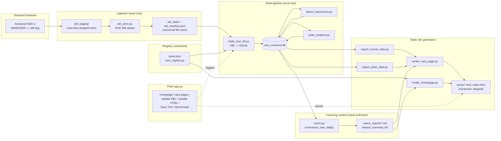

# Architecture

This document describes how Critical Mass Racing is put together: the data
pipeline that turns raw NMEA2000 logs into a race-analysis site, the module
responsibilities, the Flask routes, and the two deployment modes (local
full-access vs. published view-only). For setup/usage instructions, see
[README.md](README.md).

## System overview



## Data flow, stage by stage

1. **Logging** — the Actisense W2K-1 records raw NMEA2000 traffic to `.ebl`
   files on the boat. These get copied off (historically via `W2K_Dump/`,
   day-to-day via `ebl_staging/`).
2. **Ingestion** (`ebl_store.py`) — `.ebl` files are hashed (SHA-256) and
   copied into `ebl_data/`, the canonical store. Re-importing an
   already-known file (by content, not filename) is a no-op — this is what
   makes it safe to re-ingest a staging folder that mixes old and new files.
   `ebl_manifest.json` caches each file's decoded UTC time range so the Add
   Race picker doesn't have to re-scan every file.
3. **Registration** (`race_registry.py`, `races.json`) — a race is a record
   of `{race_date, local_start_time, series, crew_count, notes, files:
   [...], trim_end_utc?}`. This is the single source of truth for which
   files belong to which race; nothing else hardcodes that mapping. Adding
   a race — whether via the (now-unlinked but still functional) `/add-race`
   route or by hand in a Claude Code session — is just appending to this
   file, then re-running the build pipeline.
4. **Decoding** (`build_race_db.py`) — for every race in the registry,
   decodes its assigned `.ebl` files (via `ebl2csv/`, a pure-Python
   NMEA2000/Canboat decoder) into `race_sessions.db`: one table per PGN
   (position, heading, wind, boat speed, attitude, ...) plus a derived
   `nav_1hz` table — everything resampled onto a 1Hz grid, with computed
   true wind (TWA/TWS, signed) and tack side. A `trim_end_utc` on a race
   truncates decoding at that timestamp (used to cut the post-race motor
   back to the dock out of the analysis).
5. **Maneuver detection** (`detect_maneuvers.py`) — scans `nav_1hz` for
   tacks, gybes, and mark-rounding turns via hysteresis on apparent-wind
   side, filtered for noise (minimum heading change, minimum underway
   speed) so dock-time isn't misdetected as a maneuver. Writes the
   `maneuvers` table.
6. **Polar comparison** (`polar_analysis.py`, `polar.py`) — compares actual
   boat speed/angle/VMG against `j80_Polars.csv` (bilinear interpolation
   over the TWA x TWS grid) for every `nav_1hz` sample, classified by
   point of sail (beat/reach/run). Writes the `polar_performance` table.
7. **Coaching data summary** (`coach.py`) — `summarize_race_data(race_id)`
   pulls wind conditions, maneuvers, polar performance, trim, and every
   other race's overview (for cross-race comparison) into one JSON blob.
   This is *not* sent to a live API — it's the input a Claude Code session
   uses to hand-author `coach_reports/<id>.md` (per-race) or
   `season_summary.md` (season-level), following the coaching-report
   prompt template. `load_report()` / `save_report()` / `delete_report()`
   manage those files; `delete_report()` is called automatically when a
   race's trim changes, since the old report is now based on stale data.
8. **JSON export** (`export_course_data.py`, `export_polar_data.py`) —
   projects lat/lon to local metres and packages the track, maneuvers,
   waypoints (from `dyc_marks.py`), and polar points/curves/stats into
   compact per-race JSON.
9. **Static rendering** (`render_race_page.py`, `render_homepage.py`) —
   embeds that JSON (plus the coach report markdown, converted to HTML) into
   self-contained HTML pages: `races/<id>.html` per race, `index.html` for
   the homepage. These are what actually gets served and shipped.

## Two deployment modes

The app deliberately runs the same code in two different states, detected
at import time by `render_homepage.READ_ONLY = not (ROOT / "ebl_data").exists()`:

| | **Local (full)** | **Published (view-only)** |
|---|---|---|
| Where | Your Mac, via `docker compose up` (bind-mounts the whole repo) | Docker Hub image on Digital Ocean / anywhere else |
| Has `ebl_data/`, `race_sessions.db`, `W2K_Dump/`? | Yes | No — gitignored/dockerignored, too large to ship |
| Has `races.json`, `races/*.html`, `index.html`, `coach_reports/`? | Yes | Yes — these are the generated static site, committed to git and baked into the image |
| Add Race / Update EBL / Update HTML | Fully functional | Nav shows them disabled; hitting the routes directly returns a "view-only deployment" page/redirect instead of crashing on a missing database |
| Homepage view counter | In-memory, resets on process restart | Same — a new deploy is a new process, so it resets automatically with no extra logic |

This means: **races are added and reviewed locally**, then the resulting
static site is committed and pushed — to GitHub for the source/site, and to
Docker Hub (multi-arch, `linux/amd64` + `linux/arm64`, via `docker buildx`)
for the servable image. The published copy never needs a database
connection to render a homepage or a race page.

## Flask routes (`app.py`)

| Route | Method | Purpose |
|---|---|---|
| `/` | GET | Homepage — dynamically rendered every request (race list, view counter, Coach Says.., About) |
| `/index.html` | GET | Redirects to `/` (the static file on disk is a snapshot, not served directly) |
| `/races/<file>.html` | GET | Serves a static race page |
| `/CM_Logo.png`, `/CM_Instruments.png`, `/how_it_fits.png` | GET | Static image assets |
| `/benchmark` | GET | Placeholder page (planned: dedicated cross-race analytics) |
| `/update-ebl` | GET/POST | Upload form + handler for ingesting new `.ebl` files |
| `/update-html` | POST | Re-runs the full pipeline and re-renders every race page |
| `/save-trim` | POST (JSON) | Persists a race's trim cutoff, rebuilds just that race, deletes its now-stale coach report |
| `/add-race` | GET/POST | Manual race-creation form (functional but no longer linked from the nav) |

All of the mutating routes (`update-ebl`, `update-html`, `save-trim`,
`add-race`) are guarded by `_blocked_if_read_only()` / a `READ_ONLY` check,
so they degrade to a clear message instead of an unhandled exception on the
published image.

## Module reference

```
app.py                    Flask routes: homepage, race pages, pipeline actions
ebl_store.py               .ebl ingest/dedup (ebl_data/, ebl_manifest.json)
race_registry.py           races.json read/write (the race registry)
build_race_db.py           EBL -> race_sessions.db (+ rebuild_race() for one race)
detect_maneuvers.py        tack/gybe/rounding detection -> maneuvers table
polar.py                   PolarTable: parses j80_Polars.csv, interpolates targets
polar_analysis.py          nav_1hz vs. polar targets -> polar_performance table
coach.py                   Per-race data summary for hand-authored coach reports;
                           load/save/delete coach_reports/<id>.md
export_course_data.py      race_sessions.db -> course JSON (track, maneuvers, marks)
export_polar_data.py       race_sessions.db -> polar JSON (points, curves, stats)
render_race_page.py        JSON + coach report -> races/<id>.html
render_homepage.py         races.json + season_summary.md -> index.html
dyc_marks.py               Club racing marks (number, name, lat/lon)
j80_Polars.csv             Target polar table (TWS x TWA grid)
canboat.json               Canboat PGN field-decoding schema
ebl2csv/                   Pure-Python NMEA2000/EBL decoder (frame parsing,
                           fast-packet reassembly, PGN field decoding)
coach_reports/<id>.md      Per-race hand-authored coaching report
season_summary.md          Season-level hand-authored summary + priorities
races.json                 The race registry (versioned)
race_sessions.db           Decoded working database (local only, gitignored)
ebl_data/, ebl_manifest.json   Canonical raw-log store (local only, gitignored)
```

## Key design decisions

- **Registry-driven, not hardcoded.** Every race lives in `races.json`;
  nothing in the pipeline has a hardcoded list of sessions. This is what
  makes both the web form and "add a race via chat" workflows work through
  the same code path.
- **Content-hash dedup at ingestion.** `.ebl` files are identified by
  SHA-256, not filename, so re-copying a staging folder that mixes old and
  new files is always safe — already-known files are silently skipped.
- **The database is fully disposable.** `race_sessions.db` is deleted and
  rebuilt from `races.json` + `ebl_data/` on every full rebuild. Direct edits
  to it don't persist — `races.json` is the only place edits (notes, crew
  count, trim) should be made.
- **Fast single-race rebuild path.** `build_race_db.rebuild_race(id)` +
  `render_race_page.render_one(id)` avoid re-decoding every race's EBL data
  just to pick up one change (e.g. a saved trim) — full rebuilds are
  reserved for Update HTML / Add Race.
- **Coaching content is hand-authored, not API-generated.** An earlier
  version called the Anthropic API live from the Flask app; that dependency
  was removed. `coach.py` now only builds the data summary — the actual
  report text is written in a Claude Code session and saved to disk,
  keeping the app free of API-key requirements and keeping report quality
  reviewable before it's published.
- **The EBL logger's clock reads local time, not UTC**, despite internal
  field names inherited from the decoder saying "utc". This was discovered
  when a new race's file timestamp matched a stated local start time
  almost to the minute with no offset applied. Display code does **not**
  apply a timezone conversion for this reason.
